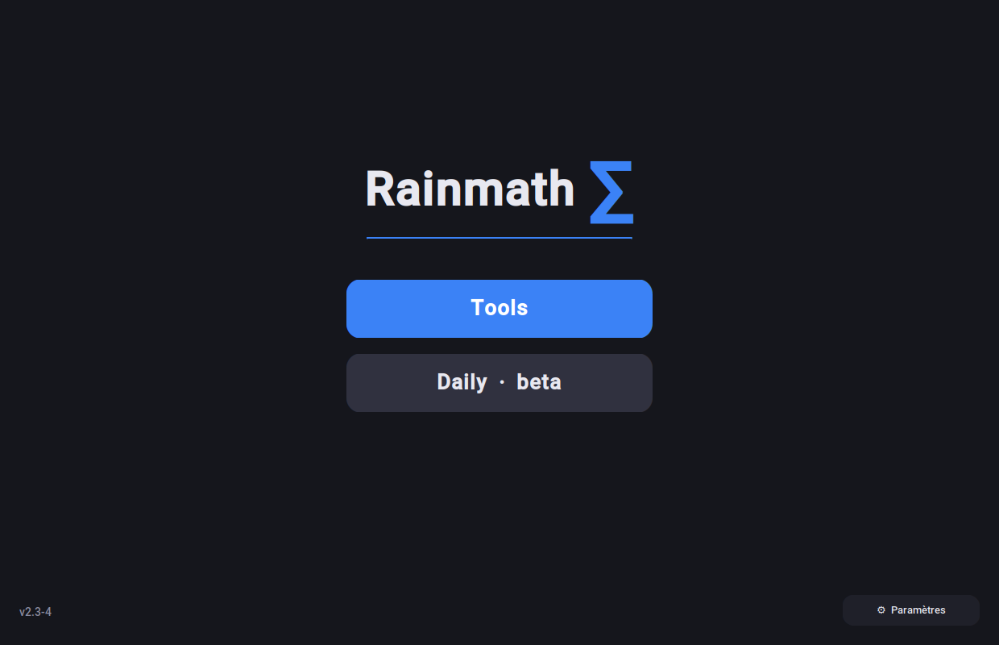
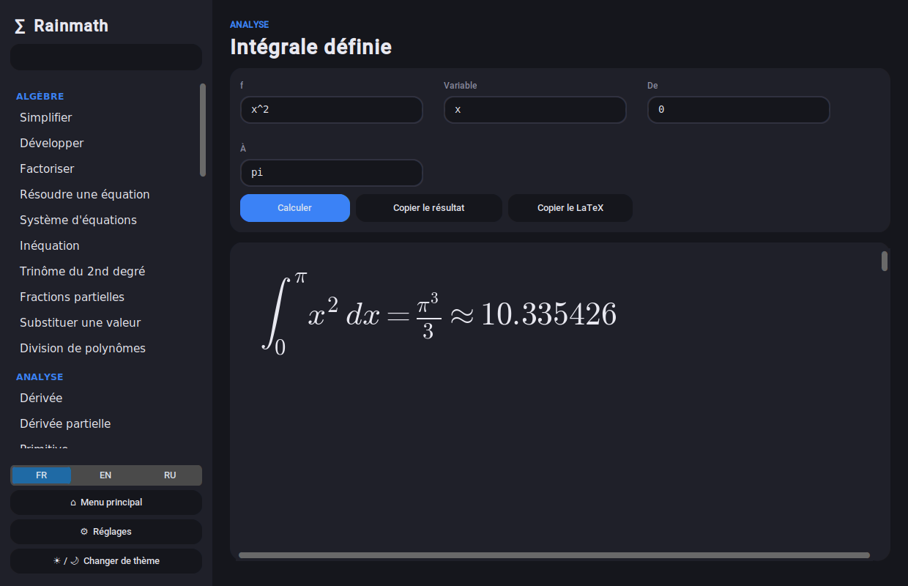
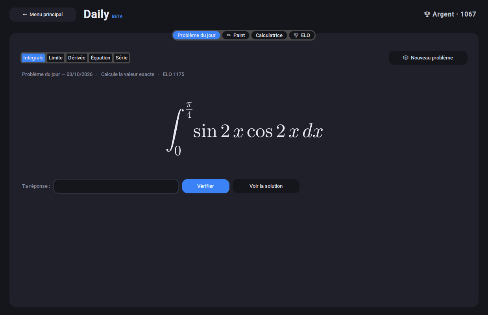
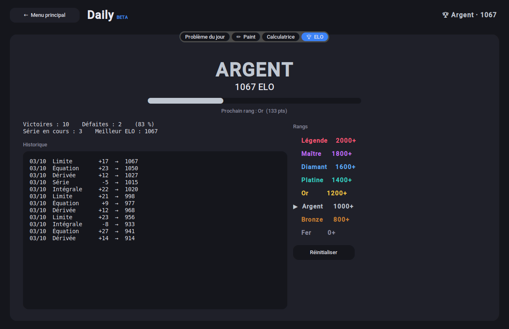
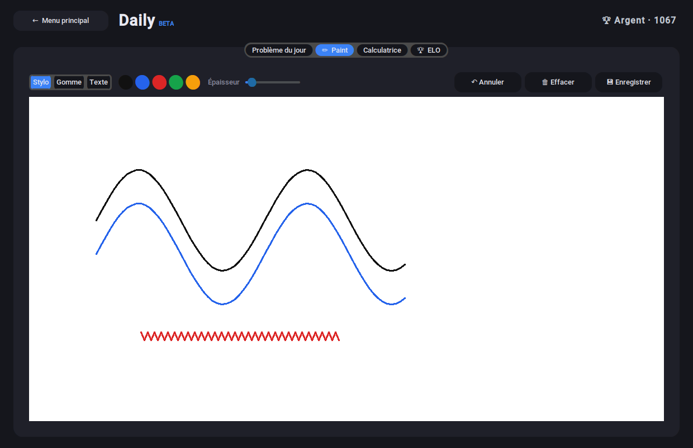
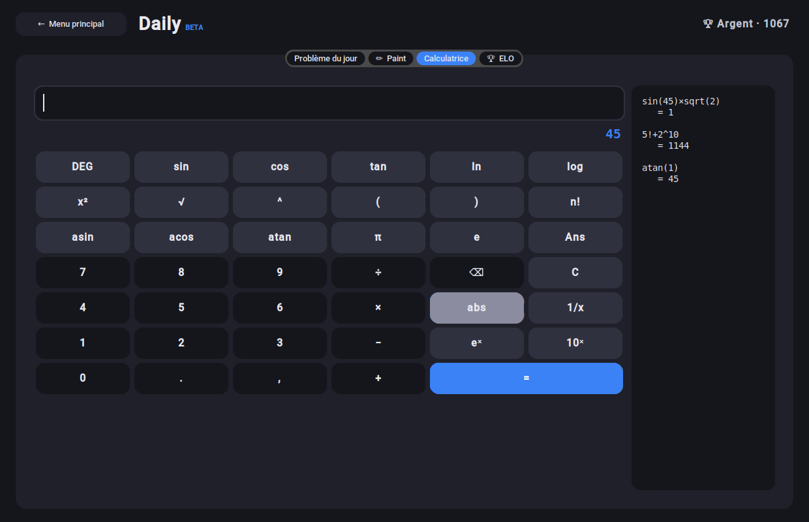

# Rainmath ∑

A desktop math toolbox written in Python with CustomTkinter and SymPy. Results are shown as proper formulas, there is a dark and a light theme, and the interface is available in French, English and Russian.

Runs on Windows and Linux. It should also work on macOS if you have Python with Tk, but that is not tested.



## What it does

### Tools

More than 50 tools with LaTeX rendering, tooltips, and a button to copy either the result or its LaTeX code.

| Category | Examples |
|---|---|
| Algebra | simplify, expand, factor, equations, systems, inequalities, quadratics, partial fractions |
| Calculus | derivatives, antiderivatives, integrals (single and double), limits, Taylor series, sums, ODEs, function plots |
| Vector calculus | gradient, Hessian, divergence, curl |
| Matrices | determinant, inverse, eigenvalues and eigenvectors, rank, products, Ax = b systems |
| Numbers | prime factors, GCD/LCM, primality test, modular inverse, combinatorics, base conversion |
| Complex numbers | modulus, argument, polar form, nth roots |
| Statistics | descriptive stats, linear regression, binomial / normal / Poisson distributions |



### Daily (beta)

- **Problem of the day**: an integral, limit, derivative, equation or series. A new one every day, generated locally with SymPy, so no API and it works offline. Your answer is checked mathematically, which means `1/4` and `0.25` are both accepted, and an expanded or factored derivative is fine too.
- **ELO and ranks**: every problem has a difficulty and your ELO goes up or down with the result, using the usual ELO formula. There are 8 ranks from Iron to Legend. Each problem only counts once. Your progress is saved.
- **Paint**: pen, eraser, text, colors, undo and PNG export, for writing your calculations by hand.
- **Scientific calculator**: trigonometry (DEG/RAD), logarithms, powers, factorial, `Ans` and a history.

| Problem of the day | ELO |
|---|---|
|  |  |

| Paint | Calculator |
|---|---|
|  |  |

## Installation

You need Python 3.9 or newer with Tk. The installers below take care of that for you.

### Windows

Double-click `installer.bat`. It installs Python if needed, then pip and all the libraries, and puts a shortcut on your desktop.

If you run `install.ps1` directly and Windows says script execution is disabled, either use `installer.bat` or run:

```
powershell -ExecutionPolicy Bypass -File install.ps1
```

### Linux

Open a terminal in the Rainmath folder and run:

```
./install.sh
```

If the file is not executable (for example after unzipping), run `sh install.sh` instead, or `chmod +x install.sh run.sh uninstall.sh linux/*.sh` once.

The script reads `/etc/os-release`, finds your distro family and runs the matching script from `linux/`. It does three things:

1. installs Python, pip, venv and Tk with your package manager (it asks before doing so, and uses sudo only for this step)
2. creates a virtual environment in `.venv` and installs the libraries from `requirements.txt` inside it, so nothing touches your system Python
3. adds a Rainmath entry to your application menu

Don't run it with `sudo`. The script refuses to, because it would leave `.venv` owned by root.

To start the app afterwards:

```
./run.sh
```

or open Rainmath from your application menu.

Options for `install.sh`:

| Option | Effect |
|---|---|
| `-y`, `--yes` | don't ask before installing system packages |
| `--no-shortcut` | skip the application menu entry |
| `debian`, `arch`, `fedora`, `opensuse`, `alpine` | skip detection and use this script |

Example: `./install.sh arch -y`

#### Supported distros

| Script | Distros | Package manager | System packages |
|---|---|---|---|
| `linux/debian.sh` | Debian, Ubuntu, Linux Mint, Pop!_OS, Kali, Raspberry Pi OS | apt | `python3 python3-pip python3-venv python3-tk fonts-dejavu-core` |
| `linux/arch.sh` | Arch, Manjaro, EndeavourOS, Garuda | pacman | `python python-pip tk ttf-dejavu` |
| `linux/fedora.sh` | Fedora, RHEL, Rocky, AlmaLinux, CentOS Stream, Nobara | dnf | `python3 python3-pip python3-tkinter dejavu-sans-fonts dejavu-sans-mono-fonts` |
| `linux/opensuse.sh` | openSUSE Tumbleweed and Leap | zypper | `python3 python3-pip python3-tk dejavu-fonts` (or the `python311` equivalents on Leap) |
| `linux/alpine.sh` | Alpine, postmarketOS | apk | `python3 py3-pip py3-tkinter py3-numpy py3-matplotlib py3-pillow py3-sympy font-dejavu` |

Each script can also be run on its own, for example `sh linux/arch.sh`. They all share `linux/common.sh`.

Notes:

- The Python that ships with the distro must be 3.9 or newer. That rules out very old releases such as Ubuntu 20.04 or Debian 10.
- On Arch the script never runs `pacman -Sy` on its own, since refreshing the database without a full upgrade can break a system. If pacman complains that a package was not found, run `sudo pacman -Syu` and try again.
- On Alpine the heavy libraries come from apk because they are prebuilt for musl, and the virtual environment is created with `--system-site-packages`. Alpine has no bash by default, which is fine because all the scripts are plain `sh`.
- Any other distro (Void, Gentoo, NixOS and so on): follow the manual install below.

#### Uninstall on Linux

```
./uninstall.sh
```

This removes `.venv` and the menu entry. System packages are left alone, and so is `reglages.json`.

### Manual install (any system)

```
python3 -m venv .venv
.venv/bin/pip install -r requirements.txt
.venv/bin/python Rainmath.py
```

On Windows the paths are `.venv\Scripts\pip` and `.venv\Scripts\python`. If you skip the virtual environment, a plain `pip install -r requirements.txt` works too, except on distros that mark system Python as externally managed (Debian 12, Ubuntu 23.04 and later, Fedora, Arch). On those you need the venv.

Tk is sometimes a separate package on Linux, for example `sudo apt install python3-tk`.

## Usage

Start `python Rainmath.py` (or `./run.sh` on Linux). The menu offers Tools and Daily. Settings such as theme, accent color, decimals, language and the imaginary unit `i` or `j` are in the Settings window and saved in `reglages.json`, next to the script and ignored by git. If the folder is read-only, the file goes to `~/.config/rainmath/` instead.

Formula syntax: `^` for powers, `pi`, `e`, `oo` for infinity, `i` or `j` for the imaginary unit. Implicit multiplication works (`2x`, `3(x+1)`).

## Troubleshooting on Linux

**The window is tiny on a high resolution screen.** Set a scale factor before starting:

```
RAINMATH_SCALE=1.5 ./run.sh
```

Use 2 for a 4K screen, for example.

**ModuleNotFoundError or "needs Tk" at startup.** Run `./install.sh` again, or make sure you start the app with `./run.sh` and not with the system `python3`, which doesn't see the libraries in `.venv`.

**Wayland.** Tk runs through XWayland, so make sure it is installed (it is by default on GNOME and KDE). Fonts can look a bit less sharp than on X11.

**Odd or missing symbols.** Install a font with wide Unicode coverage, such as DejaVu or Noto. The installers already add DejaVu.

**Copied text disappears after closing the app.** This is how the X11 clipboard works when no clipboard manager is running. Paste before you close Rainmath, or run a clipboard manager.

## Project layout

```
Rainmath.py        the whole application (single file)
requirements.txt   Python dependencies
installer.bat      Windows install, double-click
install.ps1        PowerShell script called by installer.bat
install.sh         Linux install, detects the distro
linux/             one script per distro family + common.sh
run.sh             starts the app inside .venv (Linux)
uninstall.sh       removes .venv and the menu entry (Linux)
docs/              screenshots
```

## License

MIT, see [LICENSE](LICENSE).
